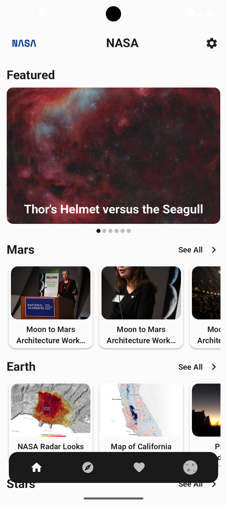
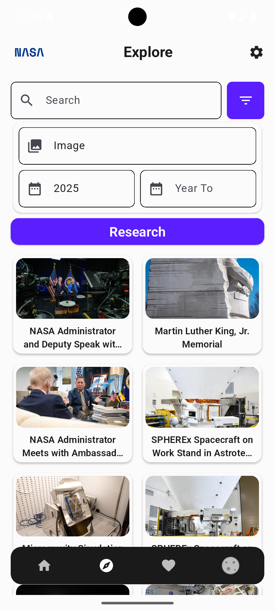
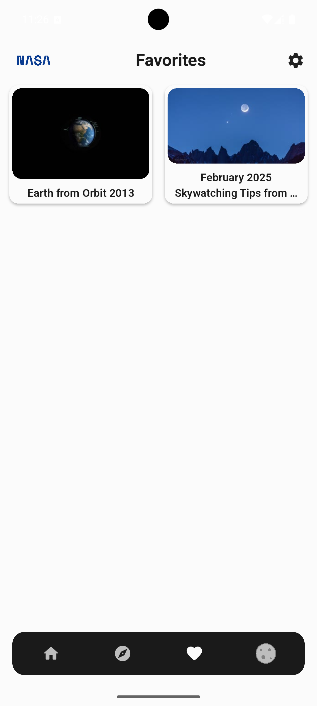
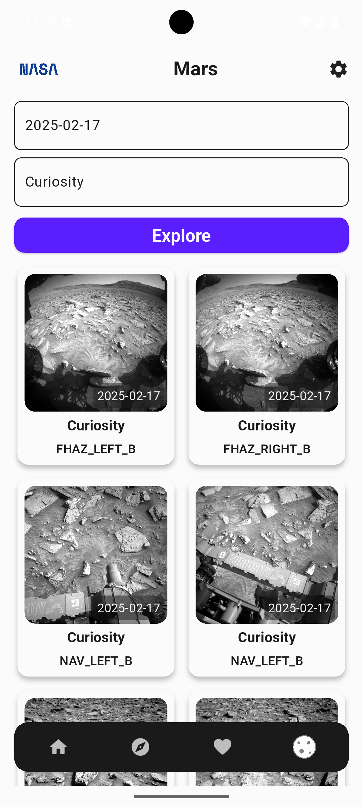
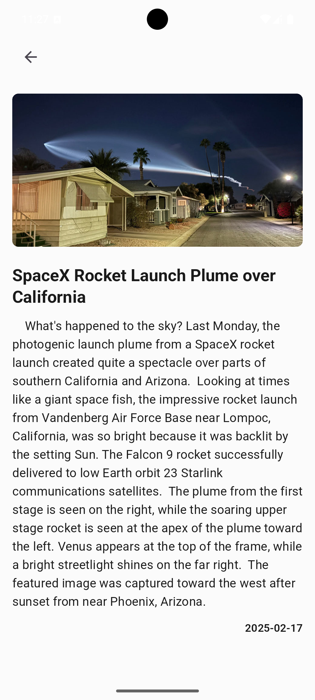
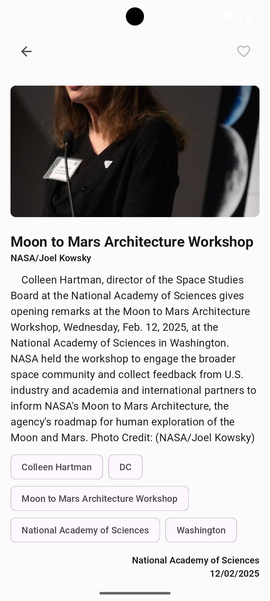
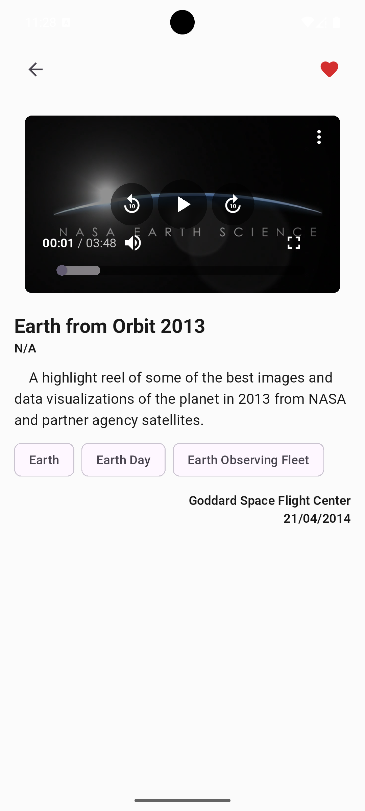
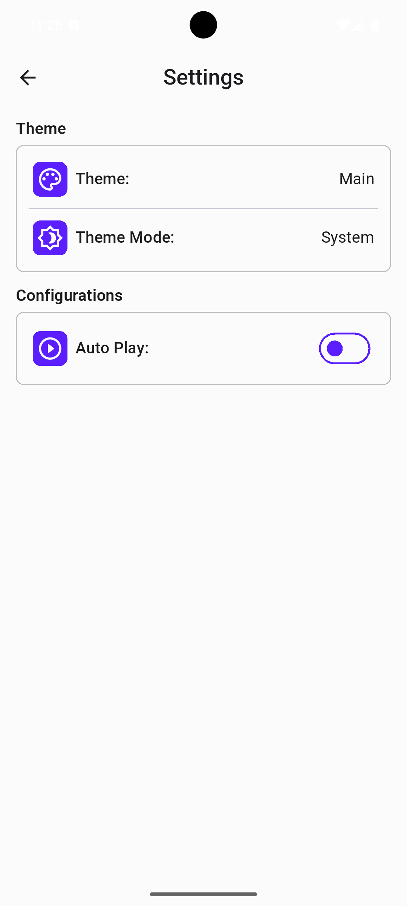

# Neon Apps Flutter Final Project (NASA API)

## Description

This Flutter project utilizes the NASA API to provide users with a rich and interactive experience exploring space-related media. Users can view the Astronomy Picture of the Day (APOD), browse images captured by Mars rovers, and search through NASA's extensive library of images and videos. The app also allows users to search for media by date and type, and save their favorite items for easy access.

## Features

- Display the Astronomy Picture of the Day (APOD) from the NASA API
- Display Rover images from the NASA API
- Display Nasa library images and videos from the NASA API
- Search for images and videos by date and media type
- Save media to favorites

## Screenshots

    
    
    
    
    
    
    
                                

